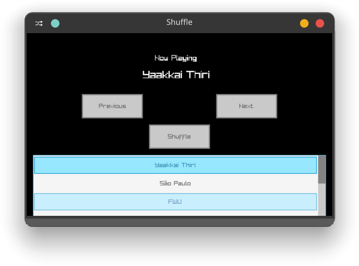

# Spotify Shuffling Algorithm
  
A C++ Raylib Music Player **Replica** that uses a **Spotify-style weighted Shuffling Algorithm**.  
At present its just a UI and shuffle-logic, not a full fledged music player. Maybe in Distant Future It might get developed into a **Fully Fledged Music Player with Spotify-Style Shuffling Algorithm**.
  
The songs are already hardcoded into `song.json`.
## Note: This Application follows **JSF AV C++ Standards** for safety-critical software. 

## Features
- Shuffle Button that shuffles according to your likings
- Scrollable Songs list
- Next and Previous Navigation Button
---
## Dependencies
- Raylib
- Raygui
- nlohmann/json
---
## Build 
For Linux: Run `make`  
For Windows: Modify `Makefile` for NT Kernel and Run `make`
---
## JSF AV Compliance
- No global variables
- State passed by reference
- Single-exit functions
- static_cast<> instead of C casts
- Fixed width types (int32_t)
- static const instead of #define for constants
---
## Performance
`./engine  0.32s user 0.10s system 80% cpu 0.524 total`